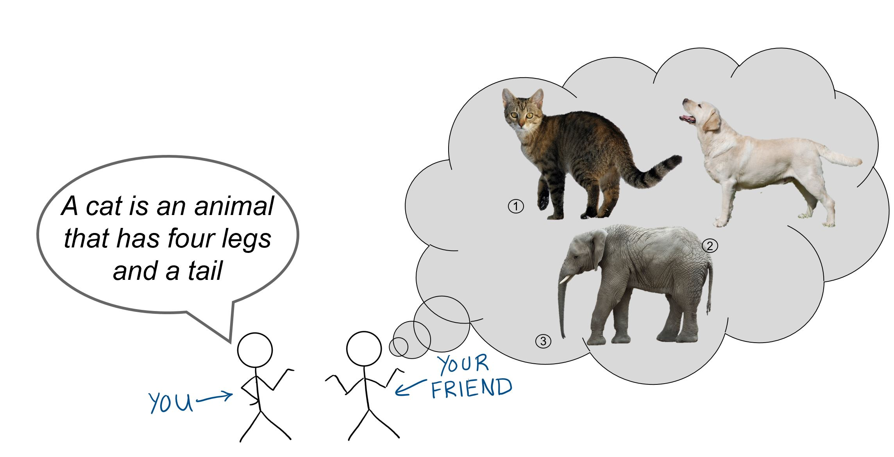
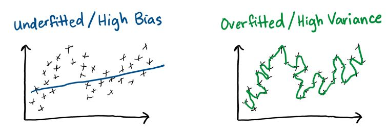
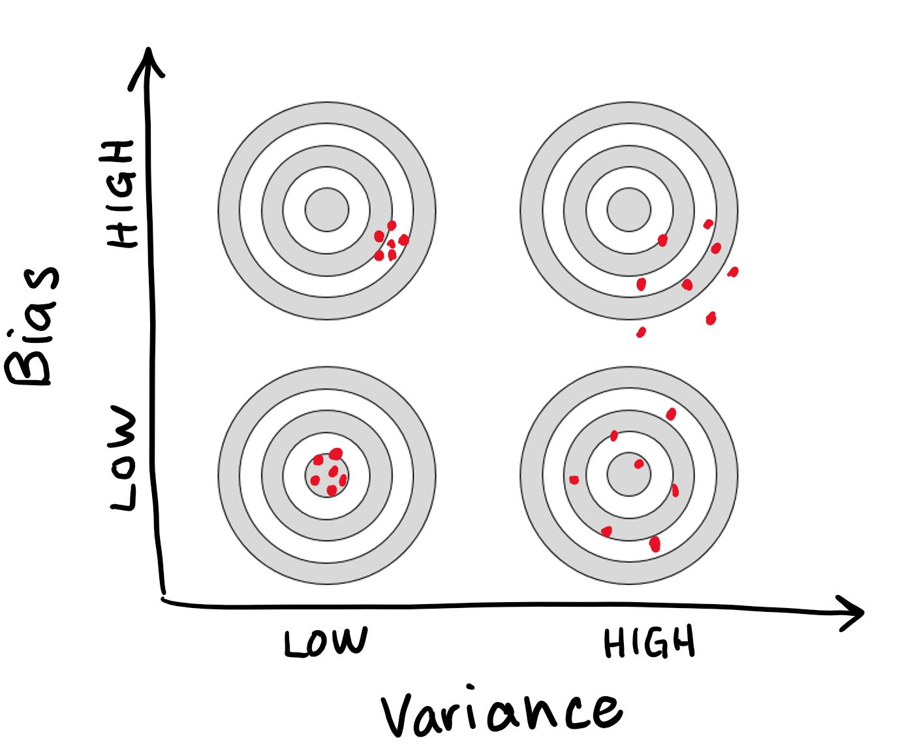
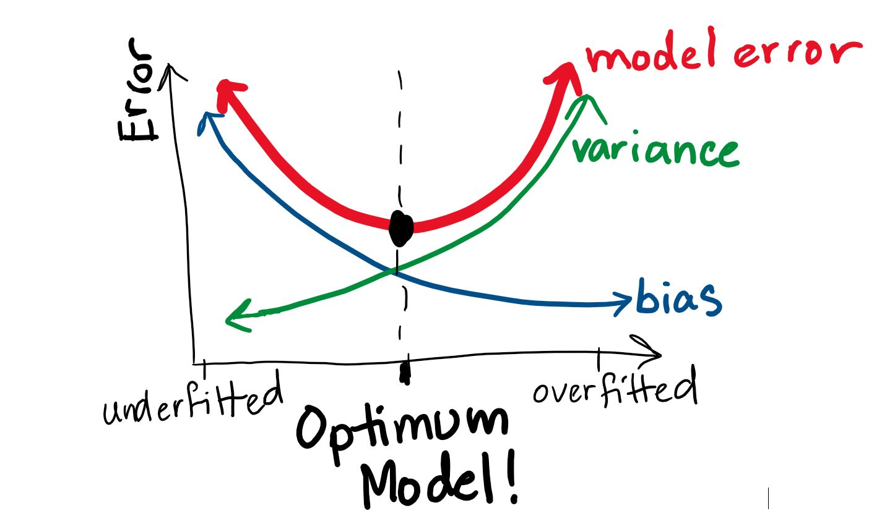
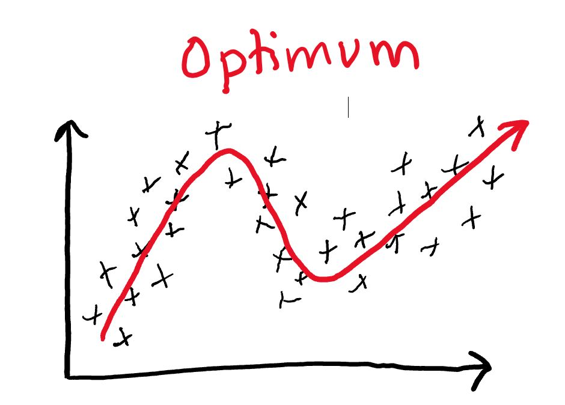

### Let's set the scene with a quick analogy...

Imagine you have a friend who has no idea what a cat is and you're trying to explain it to them. You might start off by saying that a cat is an animal with four legs and a tail. If this is all the information your friend has to go on, he or she might think any four-legged animal with a tail (i.e. dogs, elephants, etc.) is a cat. 

*Note: all iamges sourced from Wikimedia Commons, licensed for reuse under Creative Commons (CC0). Links: [1](https://commons.wikimedia.org/wiki/File:Felis_catus-cat_on_snow.jpg), [2](https://commons.wikimedia.org/wiki/File:Yellow_Labrador_Retriever_2.jpg), [3](https://upload.wikimedia.org/wikipedia/commons/4/40/Frilagd_elefant-grå_bakgrund.jpg)*

You realize that you made a mistake in being too general, so now you give your friend a detailed description of your pet cat.  Maybe you even show your friend a few pictures.  Now your friend is much better equipped to recognize that an elephant is not a cat, but what happens if you show them a hairless cat? Or a lion? Or a picture of Garfield? Based on the specific description and pictures you just gave them, they might not be able to infer that those are also cats. 

### So how does this relate to machine learning models?

Trying to find a balance between being "too general" and "too specific" is also a challenge with developing machine learning models.  This is what people are referring to when they talk about **bias-variance tradeoff***. 

Machine learning algorithms use training data to develop a model, and then we check the model against test data to see how well it works.  If our model is too general, we say it is **underfitted** and has a **high-bias**.  This means our model might be too simple to capture the key relationship or pattern. If it is too specific, we say it is **overfitted** and has a **high-variance**. This means our model fits our example data really well, but might not be very good at making predictions.

The two plots below show extreme examples of underfitting and overfitting.  The black x's represent the training data, and the blue and green lines show the relationship that the model developed. 

Neither example looks like it would do a good job at predicting the next point.  

Imagine we had another set of equally valid training data that we wanted to check our model against.  The underfitted/high-bias model relationship is so general that it would likely give similar predictions for another set of data (even though they might not be anywhere near the right answer). The overfitted/high-variance model relationship is so complex and sensitive to the training data that it would likely give very different predictions for another set of data.  If we were to measure our predictions against the desired output (or target), we would see that high-bias model predictions plot closely together (but not necessarily near the target), and that high-variance model predictions are more scattered:

*Image inspired/adapted from:https://epogrebnyak.github.io/econometrics-navigator/topics/bias_variance_tradeoff.html*

In an ideal world, our models would have low variance *and* low bias and would give us perfect predictions every time (or "hit the bullseye"!). Unfortunately this is not possible because you can only decrease one by increasing the other.  To reduce bias, we need to start fitting our example data more closely...but this increases the variance. Likewise, to decrease variance, we need to reduce our reliance on the example data...but this increases our bias. 

Consider this plot:

*Image inspired/adapted from: http://scott.fortmann-roe.com/docs/BiasVariance.html*

Our best model is actually not the one with lowest bias or lowest variance, it's where we find an optimum balance between the two. This is why we call it a "tradeoff". 

Going back to our earlier examples of training data plots, an optimum relationship might look closer to this:

It captures the general pattern of the training data, while ignoring the "noise". 

### Wrapping things up

To summarize, both high-bias and high-variance are undesirable in machine learning models. High-bias comes from underfitting training data, meaning the model might be too simple and miss key relationships needed to make accurate predictions.  High-variance comes from overfitting the training data, meaning the model might be too sensitive to noise in the training data and also miss key relationships.  

The bias-variance tradeoff represents the challenge of developing models that are both low-bias and low-variance when it is impossible to decrease one without increasing the other. Finding the right balance between bias and variance is an important consideration to keep in mind when choosing or applying any machine learning model.