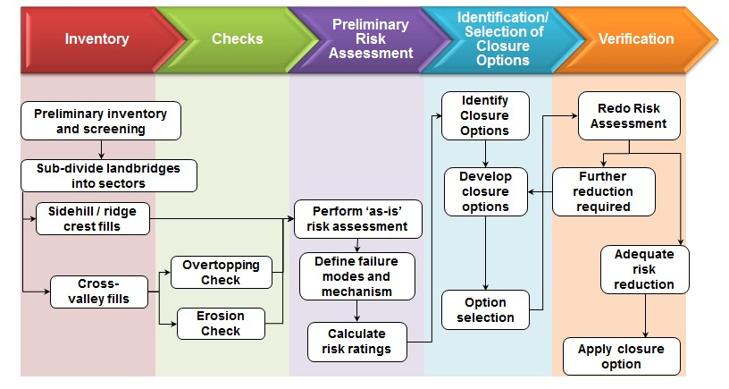
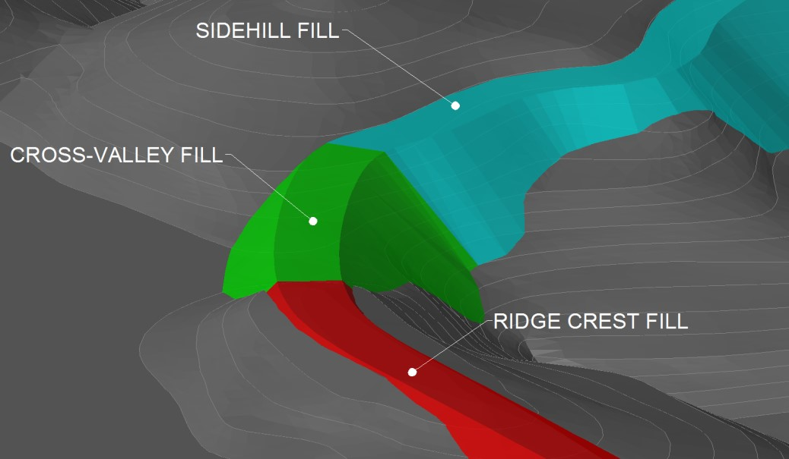

*This article originally appeared in AusIMM Bulletin 57 on Mine Rehabilitation (2014)*

#### Introduction 

Landbridges used in a mining environment can be defined as “structures constructed of earthen materials to facilitate access between high points in the natural landscape”. Landbridges are typically used for transportation within mining areas and can be constructed by end-tipping readily available fill such as waste rock.  Landbridges are similar to haul roads in that they are used for transportation within mining areas, and like waste dumps can be constructed by end-tipping waste rock fill.  However landbridges are unique structures that require special analysis because of their potential to impede watercourses..  Recently, SRK was approached by an operator seeking assistance in developing closure guidelines for landbridges at one of their operations. An extensive literature review found no current legislation, regulation, or industry best practice relating to the closure of these structures. This article details the framework that was developed to determine appropriate closure solutions for landbridges to achieve pre-defined closure objectives. 

#### Closure approach

There is an abundance of information on industry best practices and legislation for the closure of structures such as haul roads and waste dumps, and many operators  have developed internal guidelines for these structures.    In some cases landbridges or portions of landbridges can be considered as haul roads or waste dumps and closed using site-specific or generic industry best practices (if site-specific guidelines are not in place).  In other cases, specific landbridge guidance is required. 

SRK adopted a risk-based closure framework based on relevant guidelines that consideredincorporated site-specific data and closure objectives. The approach has been developed assuming site-specific closure objectives are already in place and are well understood. Typical objectives include providing a safe and stable landform, ensuring compatibility with the surrounding environment, and preventing the need for long-term maintenance and liability. The framework is presented as a series of steps that can be applied for landbridges at any operation and comprises the following:
•	inventory preparation
•	technical checks
•	preliminary risk assessment
•	identification and selection of closure options 
•	verification of risk reduction

*Closure approach flow diagram*

#### Inventory

Inventory involves gathering and compiling all known information on each landbridge.  The inventory typically includes details on construction methods, landform geometry, current and final land use, geotechnical and geochemical characteristics of the construction material, proximity to planned or future mining infrastructure, and interaction with natural features (i.e. catchments, drainage lines, proximity to protected areas). 

Landbridges that will eventually fall into planned pit areas or be covered by a future waste dump are screened and separated from the analysis.

The remaining landbridges are then sub-divided into segments based on three types of fill configuration: cross-valley fills, ridge crest fills, and sidehill fills. Any landbridge may comprise multiple fill segments that will each require individual analysis because of the differing hazards. l. 

*Landbridge subdivisions*

#### Technical checks

All landbridge segments must undergo technical checks relating to static and post-earthquake stability, erosion potential, and potential material weathering. Cross-valley fill segments have the  potential to cause significant ponding of water and require additional technical checks as they may be subject to piping or overtopping failures. Both overtopping and piping may lead to localised or major slope failures.

The potential for overtopping needs to be evaluating considering both the design rainfall (typically the 1-in-100 year annual recurrence interval in Australia) and Probable-Maximum-Precipitation (PMP) events, and the volumetric storage capacity upstream of the landform.  

A piping failure due to soil erosion can occurs as result of water seeping through the embankment.occurs due to recurrent erosion of particles from water seeping through the body of fill. The piping potential is therefore is evaluated considering factors such as material erodibility and dispersivity, placed densities and void ratios, and the presence and location of internal water gradients. 

#### Preliminary risk assessment

The inventory and results of the technical checks are used as inputs into a preliminary risk assessment.  This risk assessment analyseis the inherent risks, and considers each structure “as is”, i.e. before the application of any closure control measures.  A failure-mode-effect-analysis approach was adopted considering all possible failure modes and triggers, and then assigning a risk rating to each failure mechanism based on the severity of the consequence and likelihood of occurrence.  The first step in such an approach involves compilation and identification of all the potential hazards. Hazards associated with landbridges can typically be grouped into three categories:
1.	Natural causes/hazards or external threat conditions such as heavy rainfall, flooding and seismic events. 
2.	Technical causes/hazards or internal vulnerabilities such as design deficiencies and long-term material weathering.
3.	Operational causes/hazards such as inadequate water management practices and lack of construction records posing uncertainty regarding foundation conditions and material characteristics.
Once the hazards have been compiled, the failure mechanism and adverse consequences associated with each hazard are identified and assigned a risk rating based on a qualitative risk analysis matrix. Only low or negligible risks are considered acceptable and any risks classifying as moderate, high or critical need to be mitigated through closure controls.

#### Identification and selection of closure options

Potential closure options should be developed considering the site  specific closure objectives.  Typical objectives include safety and stability, aesthetic compatibility, and preventing the need for long-term maintenance and liability.  Some possible closure options that have been developed to align with generic closurethese objectivesclosure objectives of ensuring landform safety and stability, compatibility with the surrounding environment, and facilitating lease relinquishment include:

 - Rehabilitating landbridges that do not impact on catchments (i.e. ridge crest fills and side hill fills) using guidelines similar to those for waste dump and haul roads.  Rehabilitation includes slope regrading/reshaping, promoting free drainage and vegetation growth, to achieve a landform that is safe and stable in the long term.
 - Landbridges that do have the potential to impact catchments (i.e. cross valley fills) need to be evaluated in terms of their piping and overtopping potential.  If the risk of piping and overtopping is low, the landbridges may also be rehabilitated following waste dump and haul road guidelines.  If there is a significant risk of a piping or overtopping failure, the impeded watercourse will need to be reinstated by removing a portion of the landbridge.  
 - Reshaping landbridges to integrate with the surrounding landscape to prevent use of landbridges for transportation following closure to avoid potential ongoing liability. The use of landbridges for transportation after closure poses the need for long-term presence and maintenance to ensure users may travel along the structure safely.  
 - In all cases, designing final closure landform geometries considering the erodibility of the construction material. 
 - Removing / decommissioning cross-valley segments with an inherent risk rating other than l‘Low’. 
Verification of risk reduction

Finally, the risk assessment is repeated to determine the post-closure rating after the selected closure option is in place.  This is used as a check to verify that the risk has been sufficiently mitigated or removed.  If there are residual risks classifying as moderate or above, an alternative closure option is required.  The process of identifying and selecting closure options followed by verification of the residual risk continues iteratively until an adequate level of risk reduction is achieved. 

#### Recommendations for future landbridges

The closure approach applied to an existing operation revealed that some risks can be reduced through a strong understanding of the closure objectives and strategic planning at the design stage. The following is a list of recommendations to consider for future landbridges: 
 - Landbridges can be constructed in lifts (similar to waste dumps) designed to minimise the reshaping works required to achieve closure landform slopes.balance and reduce the cut-and-fill work for closure rehabilitation works.  
 - Risk assessments should be carried out at the design stage to verify alignment with closure objectives.  This will allow timely identification of closure issues, some of which can be addressed during construction, thereby minimising future rehabilitation work.
 - High risk areas with historical erosionLandbridges constructed from material with a high risk of erosion can benefit from instrumentation to monitor erosion to allow verification and improvement of criteria regarding material erodibility classification and recommended slope angles for rehabilitation.  
 - All risk assessments should be treated as baseline studies to be updated when new hazards are identified, and used as a dynamic tool for future risk evaluations.

#### Conclusion 

Although landbridges are similar to other types of structures such as haul roads or waste dumps, they are unique landforms that require special consideration because of their potential to obstruct catchments and impact watercourses.  The framework presented seeks to provide industry best practice guidance for the closure of landbridges.  Although it has been developed for a specific site, with some modifications it may be applied to any mining operation.  It is widely recognised that there are substantial benefits in early closure planning and this framework provides a useful tool that, if applied at an early stage, can be used to develop cost effective and flexible closure solutions.
